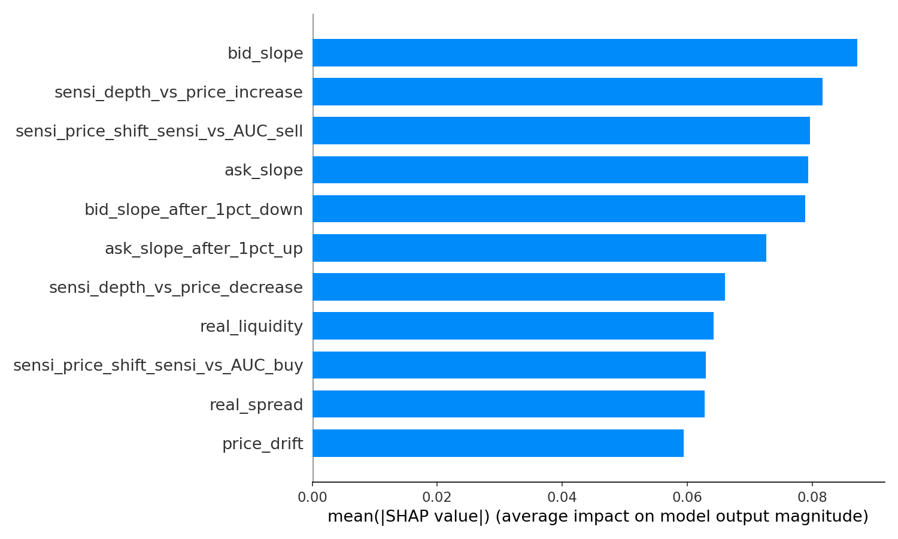
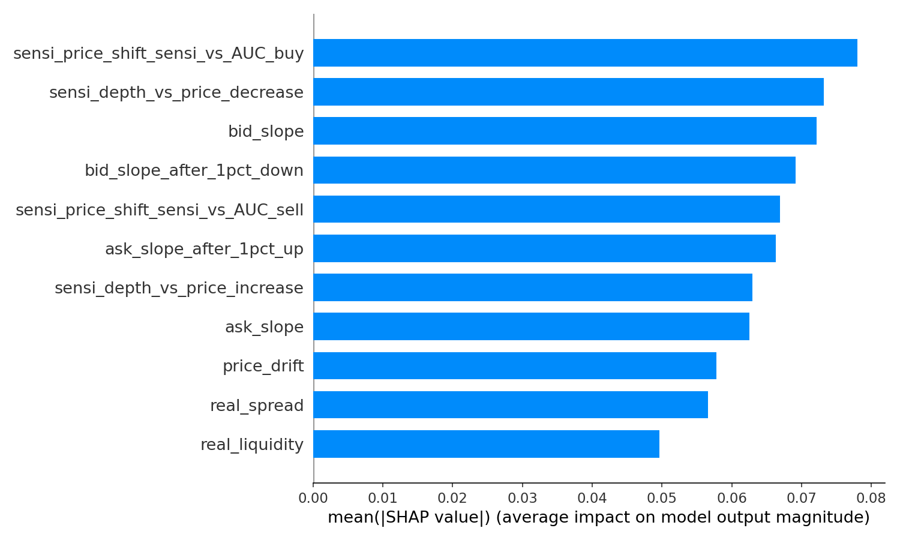
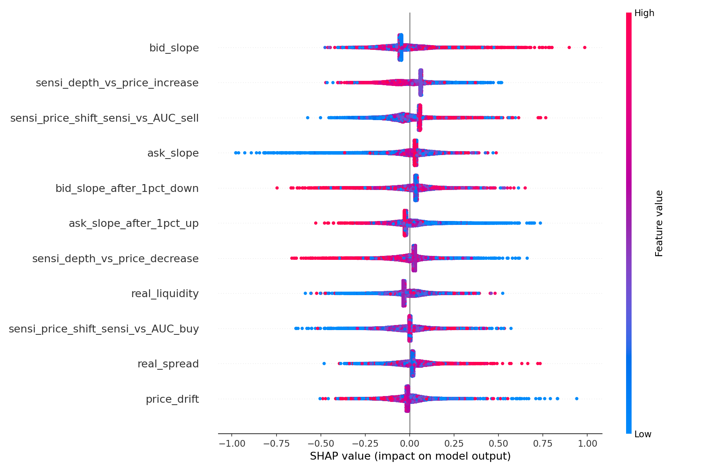
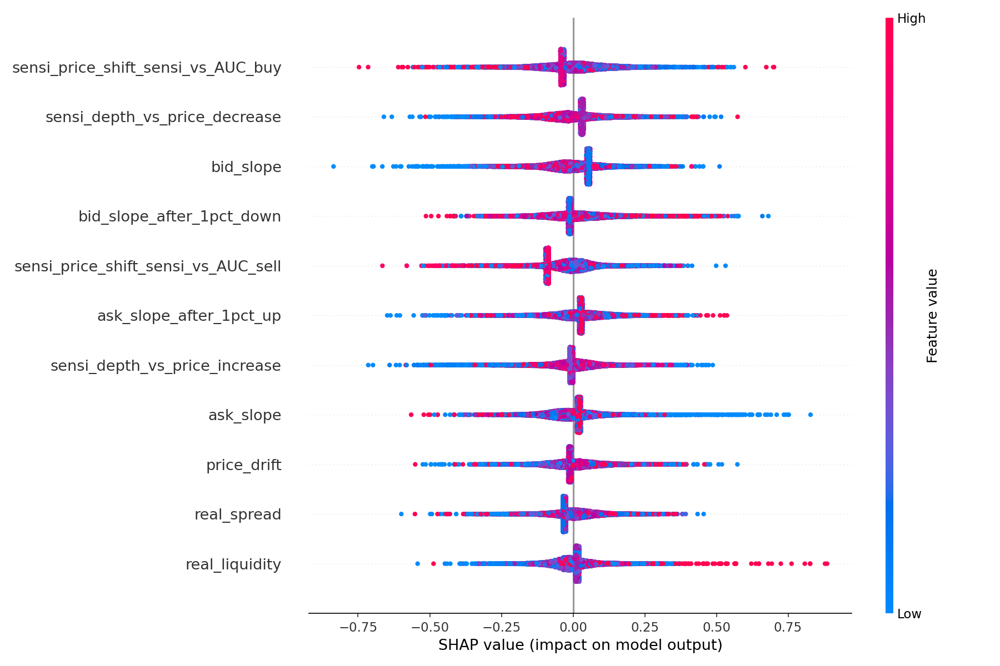

# RESULTS.md  
_Illustrative SHAP analysis of liquidity-curve features_

> **Note**  
> The figures and numbers below are **only an example of how to run the
> `shap_order_book_analysis.py` pipeline**.  They demonstrate the workflow and
> the type of insight one can extract, but they are **not** intended as a
> comprehensive or production-ready study.

---

## 1. Experimental set-up  

| Item | Value |
|------|-------|
| Symbol | `AAVE-USDT` perpetual swap |
| Look-back window | 180 calendar days |
| Bar frequency | 15 min OHLC |
| Labelling | Triple-Barrier (PT = SL = 0.87 · σ, horizon ≤ 29 bars) |
| Model | XGBoost (`multi:softprob`, *max_depth* = 4, 300 trees) |
| Features | 12 liquidity-curve metrics (see code) |
| Sample size | 15 552 bars |

---

## 2. Global SHAP feature importance  

| Rank | Feature | mean(\|SHAP\|) (up-move) | mean(\|SHAP\|) (down-move) |
|------|---------|-----------------------|-------------------------|
| 1 | **bid_slope** | 0.086 | 0.062 |
| 2 | sensi_depth_vs_price_increase | 0.079 | 0.066 |
| 3 | sensi_price_shift_sensi_vs_AUC_sell | 0.076 | 0.071 |
| 4 | ask_slope | 0.074 | 0.061 |
| 5 | bid_slope_after_1pct_down | 0.072 | 0.066 |
| … | … | … | … |

SHAP bar plots

| Up-move target (+1) | Down-move target (-1) |
|---------------------|-----------------------|
|  |  |

---

## 3. Direction-specific SHAP summary plots  

| Up-move target (+1) | Down-move target (-1) |
|---------------------|-----------------------|
|  |  |

---

## 4. Scientific interpretation  

* **Bid-side slope dominates** – A steeper bid curve (more depth close to the
  mid-price) markedly raises the probability that the _profit-taking_ barrier
  is reached before the stop-loss.  This aligns with intuition: plentiful
  near-bid liquidity cushions small sell-offs and allows upward drift.

* **Sensitivity features matter** – Both
  `sensi_depth_vs_price_increase/decrease` and the
  `sensi_price_shift_sensi_vs_AUC_*` metrics score highly.  
  They capture how **small perturbations in depth volumes translate into price
 -drift shifts**, revealing that the market impact of marginal liquidity is a
  key discriminator between break-out and fade-out scenarios.

* **Post-shock slopes add incremental signal** – `bid_slope_after_1pct_down`
  and `ask_slope_after_1pct_up` remain in the top half of features even after
  controlling for the raw slopes.  Liquidity replenishment (or lack thereof)
  after a hypothetical ±1 % move provides forward-looking information that is
  not fully contained in the instantaneous depth curve.

* **Spread & drift have secondary weight** – `real_spread`, `real_liquidity`
  and `price_drift` are still useful but contribute less once slope-related
  variables are in the model, suggesting that _gradient_ rather than _level_
  characteristics dominate short-horizon directionality.

---

## 5. Limitations and caveats  

1. **Single asset & venue** – Findings may not generalise beyond the Binance
   swaps order book of the selected symbol.  
2. **Linear depth approximation** – Complex micro-structure nuances such as
   hidden liquidity or nonlinear depth profiles are not captured.  
3. **Parameter choices** – TBM thresholds, bar length, and XGBoost hyper-
   parameters were set heuristically; different settings can change rankings.  
4. **Temporal correlation** – No train/validation split is shown here; the
   goal was to illustrate SHAP mechanics, not to optimise predictive accuracy.  
